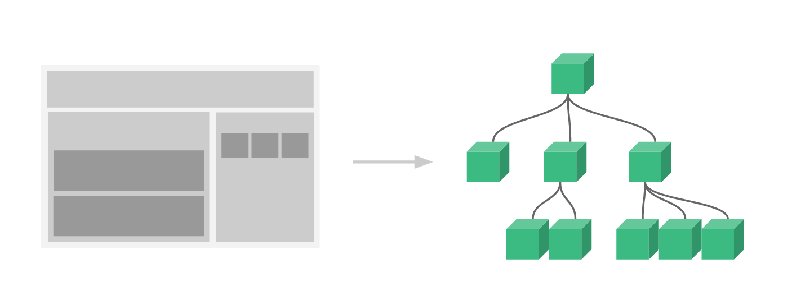
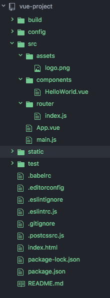

# Vue.js

Vue (pronounced /vjuː/, like view) is a JavaScript framework for building user interfaces. Vue was introduced in 2016 and took the best features of Ember, React, and Angular. It's not nearly as popular as React and Angular, but it is growing very fast
(over 70k stars on GitHub).

## Objectives

By the end of this, developers should be able to:

-   Explain what Vue is and what kinds of applications it's used for.
-   Create new applications with Vue using the vue-cli.
-   Name and describe the different layers of a Vue application.

## Preparation

```sh
# install vue-cli
$ npm install --global vue-cli
# create a new project using the "webpack" template
$ vue init webpack my-project
# install dependencies and go!
$ cd my-project
$ npm install
$ npm run dev
```

[Get the Chrome Extension](https://chrome.google.com/webstore/detail/vuejs-devtools/nhdogjmejiglipccpnnnanhbledajbpd)

[Get the Firefox Addon](https://addons.mozilla.org/en-US/firefox/addon/vue-js-devtools/)

## Advantages of JavaScript Front-end Frameworks
- Efficiency: Projects can be created much faster with well-structured, pre-built
patterns and functions.
- Safety: Popular framweworks have built-in security and are supported by large
communities where members and users act as testers.
- Cost: Most frameworks are open source and free

## Why Vue?
Unlike other monolithic frameworks, Vue is designed from the ground up to be incrementally adoptable. This is super-helpful if you're introducing Vue into
an existing application.  The core library is focused on the view layer only, and is easy to pick up and integrate with other libraries or existing projects. On the other hand, Vue is also perfectly capable of building sophisticated Single-Page Applications from scratch when used in combination with modern tooling and supporting libraries.

Vue offers two-way data-binding (a la Angular), server-side rendering (as seen in
Angular2 and React), Vue-cli, and JSX support.

[Comparisons with Other Frameworks](https://vuejs.org/v2/guide/comparison.html)

* Two-way binding means that any data-related changes affecting the model are immediately propagated to the matching view(s), and that any changes made in the view(s) (say, by the user) are immediately reflected in the underlying model. When app data changes, so does the UI, and conversely.

* With server-side rendering, your initial request loads the page, layout, CSS, JavaScript and content. For subsequent updates to the page, JavaScript is used to get some JSON data and templating is used to create the HTML.

* JSX is a statically-typed, object-oriented programming language compiling to standalone JavaScript. JSX is, however, fairly close to JavaScript especially in its statements and expressions.

## Vue Features
### Reactive Interfaces
Reactive user interfaces separate UI State (the Data) from the underlying layout of the user’s visual experience (the DOM). In Vue, models are just plain JavaScript objects. When you modify them, the view updates.

### Declarative Rendering
The core of Vue.js is a system that enables us to declaratively render data to
the DOM using template syntax. The data and DOM are linked and everything is
reactive.

### Template Logic
Vue has HTML-based template syntax, the template are valid HTML. Vue compiles the templates into Virtual DOM render functions. Combined with the reactivity system, Vue figures out the minimal amount of components to re-render and apply the minimum amount of DOM manipulations when the app state changes.

#### Text
Interpolations use Mustache syntax
```html
<span>Message: {{ msg }}</span>
```

#### Attributes
Setting attributes uses the v-bind directive
```html
<div v-bind:id='dynamicId'></div>
```
### Component System
Vue's component system lets us build applications composed of small, self-contained, re-usable components.

A component is a Vue instance with pre-defined options. Vue components are similar
to Custom Elements (a method for enableing users to define and use new types of DOM elements) which are part of the [Web Components Spec](https://www.w3.org/wiki/WebComponents/).

### Event Handling
We can use the v-on directive to listen to DOM events and run some JavaScript when they’re triggered.
```html
<div id="example-2">
  <!-- `greet` is the name of a method defined below -->
  <button v-on:click="greet">Greet</button>
</div>
```
```js
var example2 = new Vue({
  el: '#example-2',
  data: {
    name: 'Vue.js'
  },
  // define methods under the `methods` object
  methods: {
    greet: function (event) {
      // `this` inside methods points to the Vue instance
      alert('Hello ' + this.name + '!')
      // `event` is the native DOM event
      if (event) {
        alert(event.target.tagName)
      }
    }
  }
})
```
### List Rendering
We can use the v-for directive to render a list of items based on an array. The v-for directive requires a special syntax in the form of item in items, where items is the source data array and item is an alias for the array element being iterated on.
```html
<ul id="example-1">
  <li v-for="item in items">
    {{ item.message }}
  </li>
</ul>
```
```js
var example1 = new Vue({
  el: '#example-1',
  data: {
    items: [
      { message: 'Foo' },
      { message: 'Bar' }
    ]
  }
})
```
We can also display filtered or sorted results by creating a computed property that returns filtered or sorted results.
```html
<li v-for="n in evenNumbers">{{ n }}</li>
```
```js
data: {
  numbers: [ 1, 2, 3, 4, 5 ]
},
computed: {
  evenNumbers: function () {
    return this.numbers.filter(function (number) {
      return number % 2 === 0
    })
  }
}
```
### Computed Properties
Computed properties are use for complex logic. Computed properties are cached based on their dependencies and are only re-computed when needed
```html
<div id="example">
  <p>Original message: "{{ message }}"</p>
  <p>Computed reversed message: "{{ reversedMessage }}"</p>
</div>
```
```js
var vm = new Vue({
  el: '#example',
  data: {
    message: 'Hello'
  },
  computed: {
    // a computed getter
    reversedMessage: function () {
      // `this` points to the vm instance
      return this.message.split('').reverse().join('')
    }
  }
})
```

## Getting Started
Every Vue application starts by creating a new Vue instance with the Vue function
```js
let vm = new Vue({ })
```
A Vue application consist of a root Vue instance, organized into a tree of nested, reusable components which are also Vue instances.

```js
Root Instance
  |- ToDoList
    |- ToDoItem
      |- DeleteToDoButton
      |- EditToDoButton
  |- ToDoListFooter
    |- ClearToDosButton
    |- ToDoListStatistics
```

When a Vue instance is created, it adds all the properties found in its data object to Vue's reactivity system.  When the values of those properties change, the view will "react", updating to match new values.

## Project Structure


index.html
This file is the starting point of your application. Note that within the body section a div element is available which has the id property set to the string app. This div is used as a placeholder for the HTML that is generated by Vue.

main.js
This file is where the Vue application is initialized. App is the root component of our application.

App.vue
This file is the implementation of the App component. The implementation is broken up into three parts: template code, script code, css code.

## Code-Along: Let's see some books

## Additional Resources

-  "The Docs" - [Vue.js](https://vuejs.org/)
-  [5 Practical Examples for Learning Vue.js](https://tutorialzine.com/2016/03/5-practical-examples-for-learning-vue-js)
